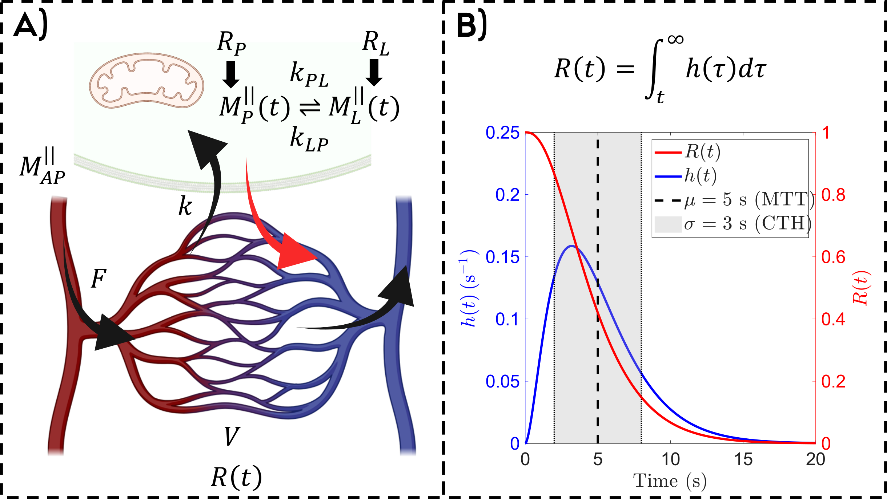
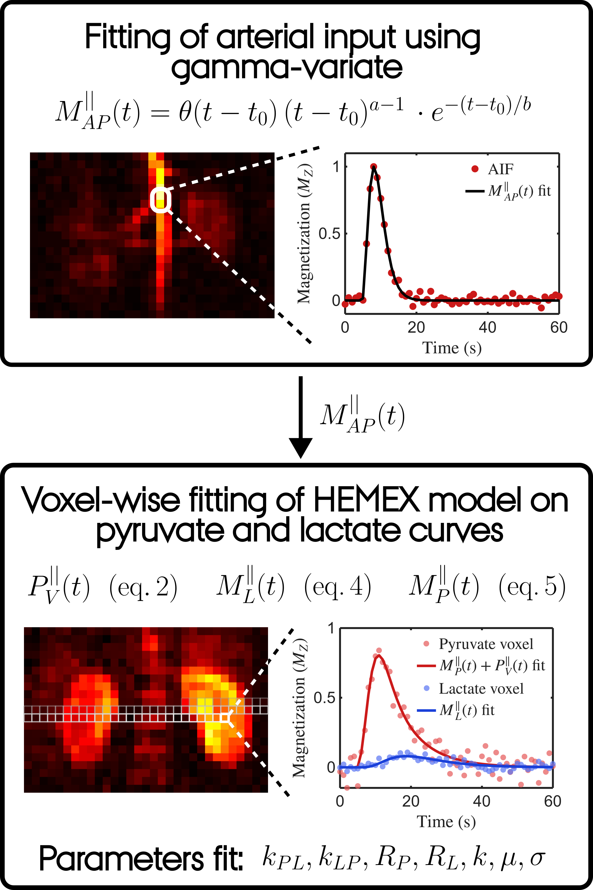
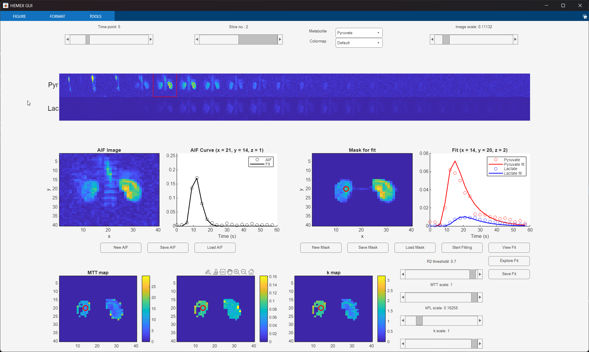

# HEMEX-HP

This repository contains a MATLAB implementation of the **HEmodynamic and MEtabolic eXchange (HEMEX) Model** for fitting of dynamic Hyperpolarized (HP) <sup>13</sup>C MR images of metabolites. Currently only two simultaneous metabolites are supported (e.g. Pyruvate and Lactate). The model is published in **[To Be Published]**. 

A biological illustration of the model parameters can be seen here:


An overview of the implementation:


A dataset example of Pig Kidneys can be found under *data/*. The supplied MATLAB GUI under *code/* gives a quick and easy way to test the model fitting on <sup>13</sup>C data, as exemplified here:



## Usage

A userguide for the GUI is available under *docs/*.

A simulation example of the model can be run in the **example_usage_Simulation.m** script.

## Requirements

```
- Optimization Toolbox  
- Image Processing Toolbox  

Code tested on MATLAB version 24.2 (R2024b)
```

## Citing this Work

If you use this repository in your research or publication, please cite our paper:

**To Be Published**